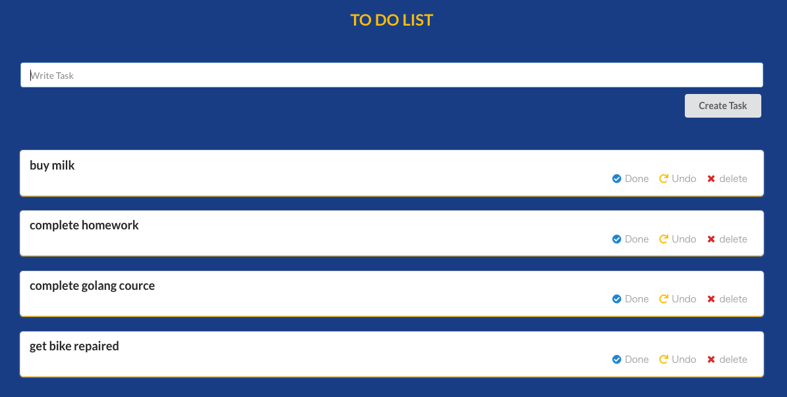

# golang-react-app
## 👟 How to run
### install
#### 1. this repository
```shell
git clone https://github.com/flet-pro/golang-react-app.git

cd golang-react-app
```

#### 2. [mongoDB](https://www.mongodb.com/)
[Docker](https://www.docker.com/)を用います。
```shell
docker container run -d -p 27017:27017 --name flet_mongo mongo:latest
```
flet_mongoのところはお好きな名前にご変更ください。\
ポートフォワーディングでDockerのポート27017をlocalhostの27017番ポートに繋いでいます。

DBの準備ができたらついでに.envファイルを用意しましょう\
.env.exampleのコピーを作成し、.envに名前を変更しましょう\
そしたら以下の内容を入力
```.env
DB_URI="mongodb://localhost:27017" #27017はポートフォワーディングで指定したlocalhost側のポート番号を
DB_NAME="example" #データベースの名前
DB_COLLECTION_NAME="todo-list" #collectionの名前
```

#### 3. [golang](https://go.dev/)
公式サイトの指示に従ってgoをインストールしてください
```shell
#バージョン確認
go version
```
次にgoのパッケージをインストール
```shell
cd server
go mod download
cd ..
```

#### 4. [react](https://react.dev/)
まずは[nodejs](https://nodejs.org/ja/)をインストール
```shell
node -v
```
次にnode_modulesをインストール
```shell
cd client
npm install
cd ..
```

### build
以下のコマンドを実行してバックエンドとフロントエンドの両方のローカルサーバーを立ち上げる
```
cd client
npm start
cd ../server
go run main.go
```
```
http://localhost:3000
```
にアクセスすれば以下のようなtodoアプリが立ち上がります。

****

※万が一dockerのDBが立ち上がっていなかったら以下のコマンドで立ち上げる
```shell
docker start flet_mongo #flet_mongoは自分が設定したコンテナ名を入れる
```

## 📋 References
https://www.youtube.com/watch?v=8mEC1X5yLjY \
https://www.youtube.com/watch?v=B5tSZr_QqXw \
https://qiita.com/tomoyukilabs/items/81698edd5812ff6acb34#%E3%83%AA%E3%82%AF%E3%82%A8%E3%82%B9%E3%83%88%E3%81%AB%E7%8B%AC%E8%87%AA%E3%81%AEhttp%E3%83%AA%E3%82%AF%E3%82%A8%E3%82%B9%E3%83%88%E3%83%98%E3%83%83%E3%83%80%E3%82%92%E8%BF%BD%E5%8A%A0%E3%81%97%E3%81%9F%E3%81%84%E5%A0%B4%E5%90%88 
